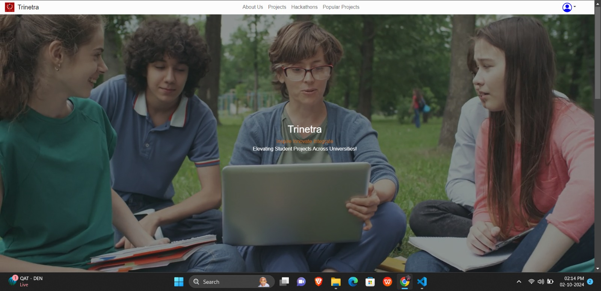
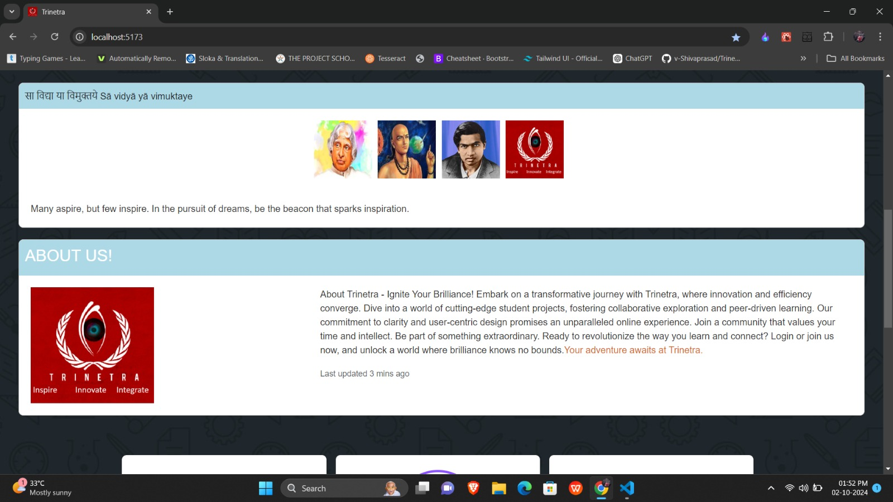
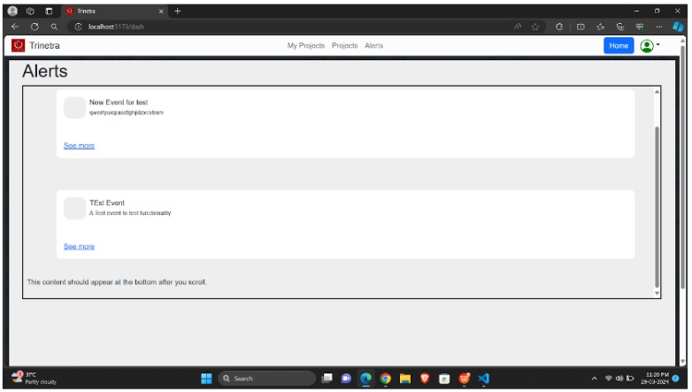
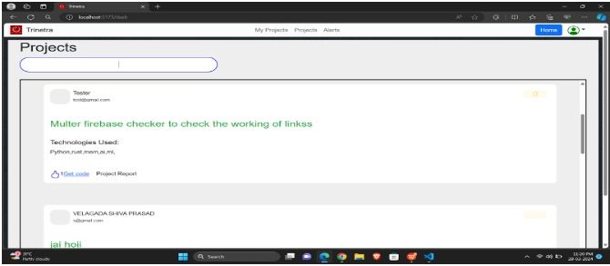
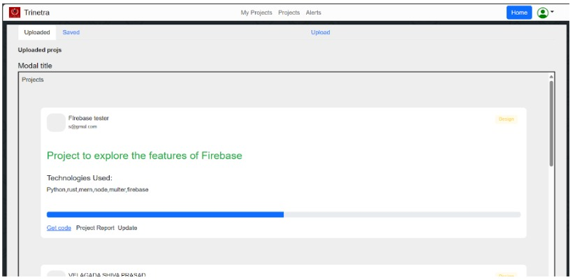
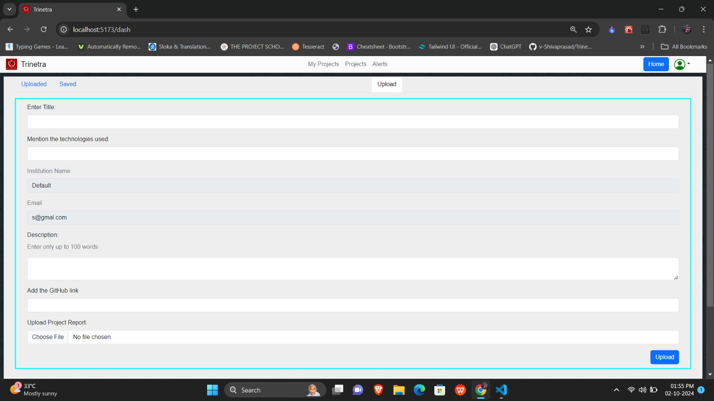

# Trinetra - A Platform for Academic Collaboration

## Introduction

**Trinetra** is a platform designed to serve as a central hub for students across educational institutions to share, explore, and collaborate on academic projects. By leveraging modern web technologies, the platform facilitates interdisciplinary research, peer learning, and collaboration opportunities within the student community.

## Purpose and Objectives

Trinetra addresses several key objectives:
- **Centralized Project Repository:** Provides a single location for students to access and share their academic projects, eliminating the need for multiple platforms.
- **Facilitate Interdisciplinary Research:** Encourages innovation and knowledge exchange by enabling students to discover projects from diverse fields.
- **Promote Peer Learning:** Fosters peer-to-peer learning by allowing students to engage with each other’s projects through discussions and feedback.
- **Collaboration Opportunities:** Notifies students about hackathons, codeathons, and other events, promoting collaboration.

## Technologies Used

- **MongoDB:** NoSQL database for storing project data and user information.
- **Express.js:** Backend framework for handling API requests.
- **React.js:** JavaScript library for building the platform's frontend.
- **Node.js:** Backend runtime environment for executing JavaScript server-side.
- **Firebase:** Cloud storage and database for managing project reports and documentation.

### Firebase Integration

Firebase is used for storing and managing project-related reports and documents. This provides scalability, secure access, and real-time synchronization. Each project submission includes a link to its documentation stored in Firebase, allowing users to upload and access reports directly from the platform.

## Features and Functionalities

- **User Registration and Authentication:** Secure account creation and login for students and admin users.
- **Project Submission:** Students can submit their academic projects with detailed information and files, including project documentation uploaded to Firebase.
- **Project Browsing:** Users can search and browse projects by various criteria.
- **Peer Interaction:** Commenting and feedback functionality allows constructive discussions on projects.
- **Event Notifications:** Alerts users to upcoming collaborative events.
- **User Dashboard:** Personalized space for managing projects, notifications, and saved projects.

## Architecture Overview

- **Server:** Handles backend logic, API routes, and database interaction.
- **Frontend (Vite-React):** Provides a responsive user interface, powered by React.js and built with Vite for fast development.
- **Admin App:** A separate app for administrators to monitor and manage platform activities.
- **Firebase Storage:** Stores project documentation and reports securely in the cloud for easy access and management.

## Future Enhancements

- Enhanced admin controls for user and content management.
- Reporting and analytics tools to track platform engagement.
- Automated alerts and integration with third-party services like email notifications.

## Screenshots

## How to Run the Project

1. Clone the repository:  
   `git clone <repository-url>`
2. Navigate to the project directory and install dependencies:  
   `npm install`
3. Configure environment variables in `.env` file, including Firebase credentials.
4. Start the backend server:  
   `npm run server`
5. Start the frontend:  
   `npm run dev`

## Contributions

Feel free to fork this repository and submit pull requests for any features or improvements.
